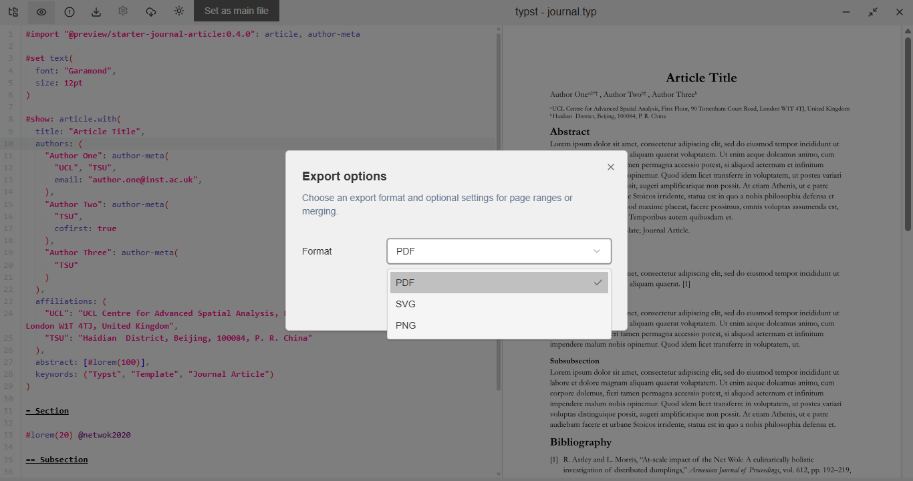
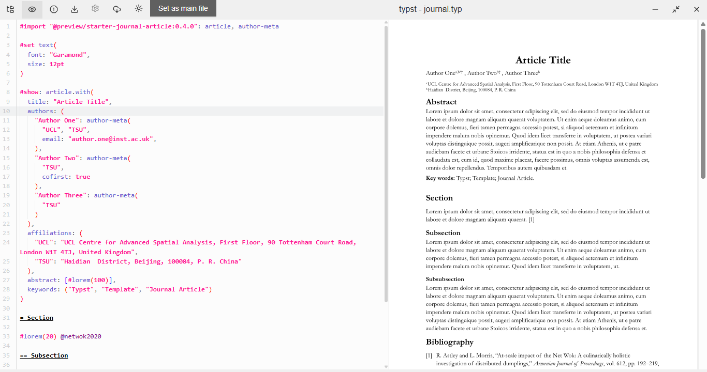
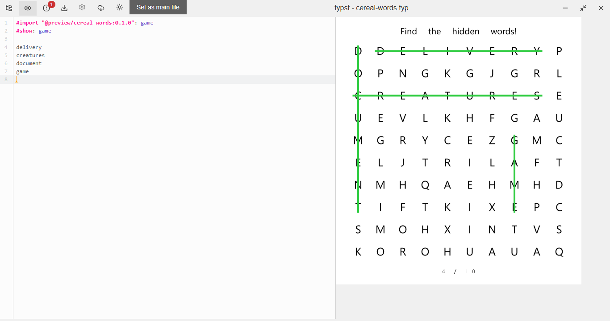
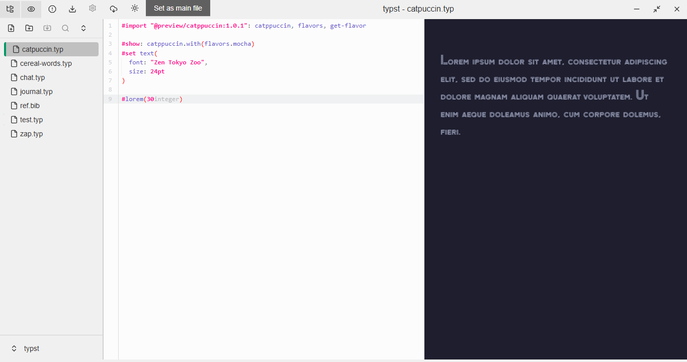

# Typwriter

**Typwriter** is a flexible, modern editor for [Typst](https://typst.app/), built with Tauri and Svelte. It allows you to write Typst documents, see a live preview of the compiled output, and export your documents directly to PDF, SVG and PNG.

## Showcase










## Features

  * **Live Preview:** See your compiled output update as you type.
  * **Source-Preview Sync:** The preview automatically scrolls to match your cursor position in the source code.
  * **Click-to-Source:** Click on the preview to jump to the corresponding position in your source file.
  * **Smart Editor:** Get autocomplete suggestions and hover-for-info tooltips.
  * **File Management:** Create new `.typ`, `.bib`, `.yaml`, and `.yml` files directly within the editor.
  * **Workspace Management:** View and load recently opened workspaces.
  * **Document Export:** Export your documents to PDF, SVG and PNG.

## Tech Stack

This project is built with a modern, cross-platform stack:

  * **Core Logic:** [Rust](https://www.rust-lang.org/)
  * **Application Framework:** [Tauri](https://tauri.app/)
  * **Frontend UI:** [Svelte](https://svelte.dev/)
  * **Typesetting Engine:** [Typst](https://typst.app/)
  * **Text Editor:** [CodeMirror](https://codemirror.net/)

## Getting Started (Development)

To run the project locally, follow these steps:

1.  Clone the repository.
2.  Install the required dependencies:
    ```bash
    pnpm install
    ```
3.  Run the Tauri development server:
    ```bash
    pnpm tauri dev
    ```

## Roadmap

### EDITOR / PREVIEW

  - [x] Write to file
  - [x] Save file
  - [x] Compile file and generate preview
  - [x] autocomplete
  - [x] hover and get tooltip info
  - [x] move preview to cursor position in source when typing
  - [x] click on preview
      - [x] move cursor to click position in source
      - [x] move to preview position / page position in preview
      - [x] open file / url
  - [ ] click on diagnostic and move to source position

### WORKSPACE

  - [ ] recently opened workspaces
      - [ ] load the recently opened workspace
      - [x] view recently opened workspaces
  - [ ] file management
      - [x] create file (typ, bib, yaml, yml)
      - [ ] rename file (no extension change)
      - [ ] move file
      - [ ] import file
      - [ ] delete file
      - [ ] export file
          - [x] pdf
          - [x] png
              - [x] all pages
              - [x] current page
              - [x] custom range
          - [x] svg
            - [x] merged
            - [x] custom range
  - [ ] tabs (maybe)
      - [ ] open
      - [ ] close
  - [ ] settings
      - [ ] theme (dark, light, system)
      - [ ] font size
      - [ ] font family
      - [ ] auto save interval
      - [ ] auto compile on save

## Acknowledgments

This project uses [Typst](https://typst.app/) as its typesetting engine.
[Typst](https://github.com/typst/typst/tree/main/) source code was very helpful in understanding how to interact with the Typst engine, I also copied some code snippets from it😅.

[Typstudio](https://github.com/Cubxity/typstudio), was instrumental in the development of this project, I used its source code as a reference.

[code-mirror-typst-lang](https://github.com/kxxt/codemirror-lang-typst) provided the Typst language support for CodeMirror, which is used in this editor.
