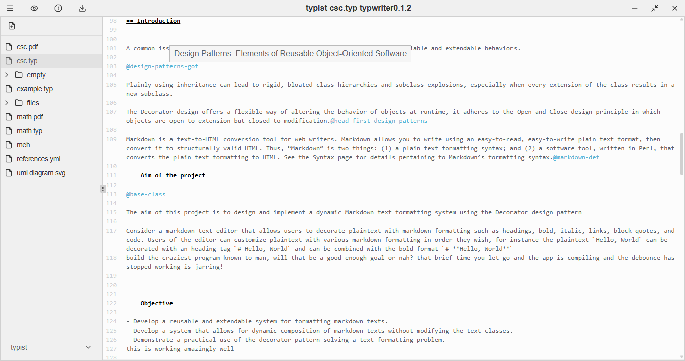
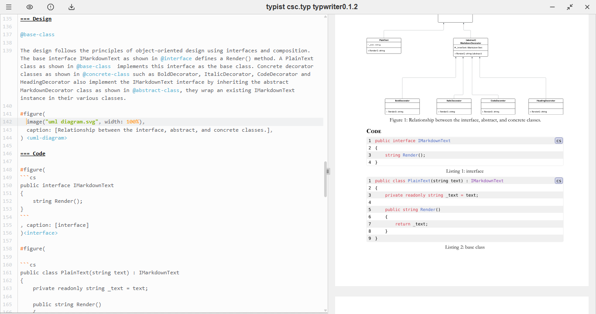
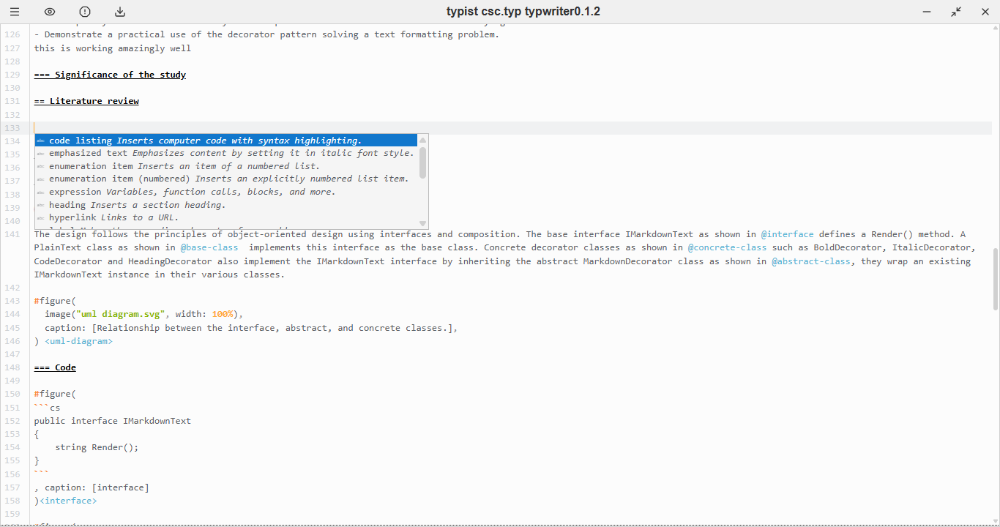
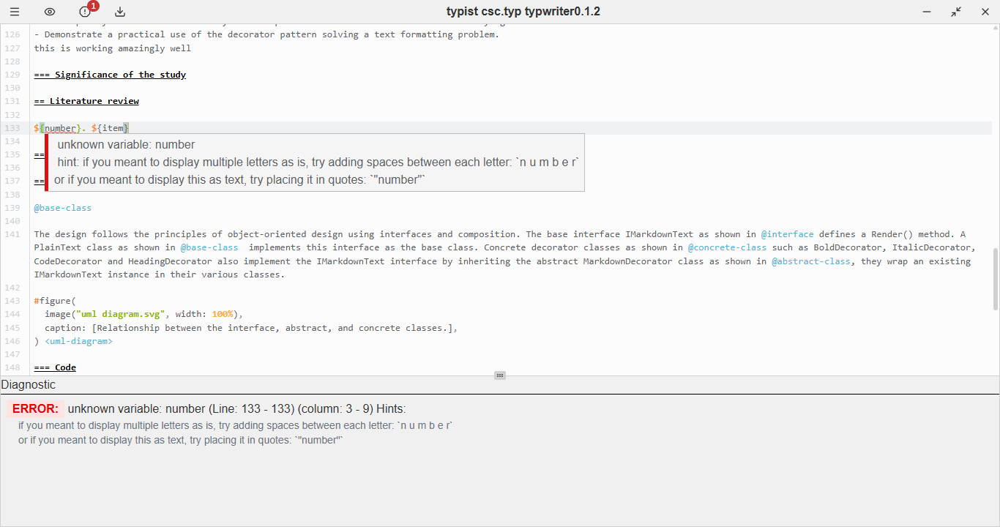

# Typwriter

A flexible editor for Typst.
Write Typst documents and see a live preview of the compiled output.
Export your documents to PDF.

## Roadmap

### EDITOR / PREVIEW

- [x] Write to file
- [x] Save file
- [x] Compile file and generate preview
- [x] autocomplete
- [x] hover and get tooltip info
- [x] move preview to cursor position in source when typing
- [x] click on preview
  - [x] move cursor to click position in source
  - [ ] move to preview position / page position in preview
  - [x] open file / url
- [ ] click on diagnostic and move to source position

### WORKSPACE

- [ ] recently opened workspaces
  - [ ] load the recently opened workspace
  - [x] view recently opened workspaces
- [ ] file management
  - [x] create file (typ, bib, yaml, yml)
  - [ ] rename file (no extension change)
  - [ ] move file (late inclusion)
  - [ ] delete file
  - [ ] export file
    - [x] pdf
    - [ ] png
      - [ ] all pages
      - [ ] current page
      - [ ] custom range
    - [ ] svg
- [ ] tabs (maybe)

  - [ ] open
  - [ ] close

- [ ] settings
  - [ ] theme (dark, light, system)
  - [ ] font size
  - [ ] font family
  - [ ] auto save interval
  - [ ] auto compile on save

## Acknowledgments

This project uses [Typst](https://typst.app/) as its typesetting engine.
[Typst](https://github.com/typst/typst/tree/main/) source code was very helpful in understanding how to interact with the Typst engine, I also copied some code snippets from it😅.

[Typstudio](https://github.com/Cubxity/typstudio), was instrumental in the development of this project, I used its source code as a reference.

[code-mirror-typst-lang](https://github.com/kxxt/codemirror-lang-typst) provided the Typst language support for CodeMirror, which is used in this editor.
